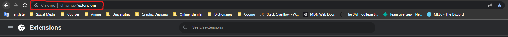
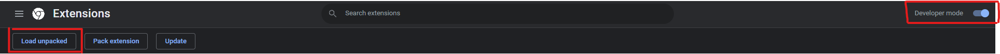

## Leads Saver Chrome Extension - Project Challenge by Scrimba

### Built with
- HTML
- CSS
- JS !Important 😉

### Learned & Practiced JS Topics in this Porject:
- const
- addEventListener()
- innerHTML
- input.value
- function parameters
- template strings
- localStorage
- The JSON Object
- objects in array

### NOTE:
- For using this chrome extension, you can simply download the file as a zip and upload it in your extensions page like the following:

- Then after you headed to this page, just turn on the developer mode and click on load unpacked:

- And then upload the folder that you've just downloaded it.
- And Boom 💥 There you have it.

