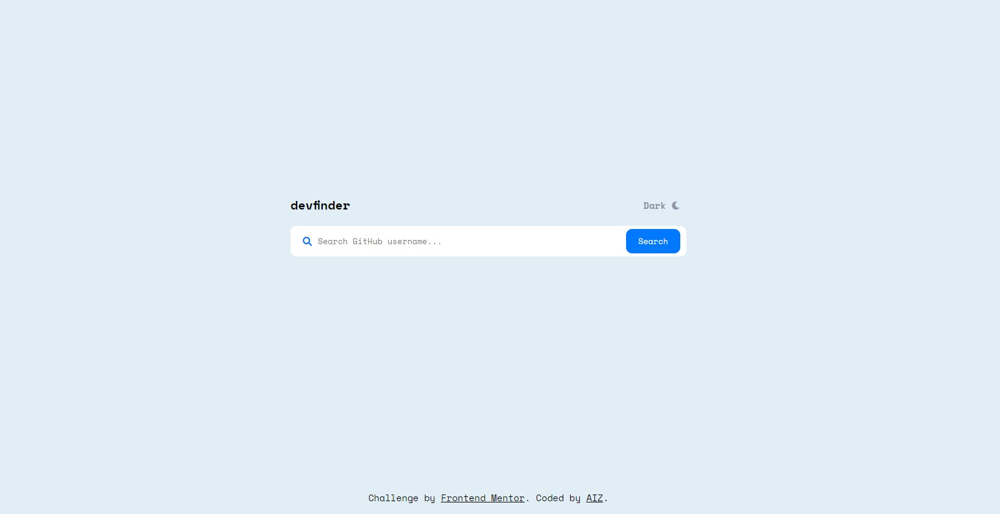

# Frontend Mentor - devfinder App (GitHub User Search App) Solution

This is a solution to the [devfinder App challenge on Frontend Mentor](https://www.frontendmentor.io/challenges/github-user-search-app-Q09YOgaH6). Frontend Mentor challenges help you improve your coding skills by building realistic projects.

## Table of contents
  - [The challenge](#the-challenge)
  - [Screenshot](#screenshot)
  - [Links](#links)
- [My process](#my-process)
  - [Built with](#built-with)
  - [What I learned](#what-i-learned)
  - [Useful resources](#useful-resources)
- [Author](#author)

### The challenge

User should be able to:
- View the optimal layout for the app depending on their device's screen size
- See hover states for all interactive elements on the page
- Search for GitHub users by their username
- See relevant user information based on their search
- Switch between light and dark themes

### Screenshot




### Links

- Solution URL: [Solution Here](https://github.com/azimifardous/50-Project-Challenges-of-Fundamentals-of-HTML-CSS-JS.git)
- Live Site URL: [Live Preview Here](https://github-user-search-ap.netlify.app/)

## My process

### Built with

- Semantic HTML5 markup
- CSS custom properties
- Vanilla JavaScript
- Flexbox
- Custom UI/UX
- Custom Fonts
- Mobile-first workflow

### What I learned

I've learned and practiced ```async-await```, ```fetch()``` methods of fetching an API and retrieving data.

let me know if I correctly used the async-await and fetch methods:
```js
async function requestData(username) {
    const API_URL = `https://api.github.com/users/${username}`
    const response = await fetch(API_URL);
    const data = await response.json();
    generateProfile(data)
    if (!response.ok) {
        showError()
    }
}
```

### Useful resources

- [RapidAPI](https://rapidapi.com/) - You can find many usefull APIs to integrate with.
- [Github Rest API](https://docs.github.com/en/rest) - REST API: To create integrations, retrieve data, and automate your workflows, build with the GitHub REST API.

## Author

Feel free to contact me and share your thoughts, suggestions, obligations with me about this project.
- Frontend Mentor - [@azimifardous](https://www.frontendmentor.io/profile/azimifardous)
- Twitter - [@azimifardous](https://www.twitter.com/azimifardous)
